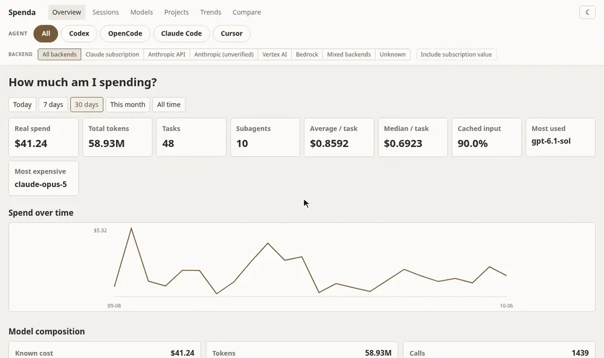

# Spenda

A local dashboard for token usage, costs, models, projects, and session activity from Codex, OpenCode, Claude Code, and Cursor.



## What you can see

- Spend, token, and call trends
- Model composition and cache usage
- Sessions, subagents, projects, and source-specific reports
- CSV and JSON exports
- Light and dark themes

The dashboard reads local history and stores its own reporting database. It does not send source data to an external service.

## Install

Requires Python 3.11 or newer and at least one supported coding agent with local history.

### With uv

```bash
uv sync
uv run spenda ingest --all
uv run spenda serve
```

### With pip

```bash
python -m venv .venv
source .venv/bin/activate
python -m pip install -r requirements.txt
python -m pip install .
spenda ingest --all
spenda serve
```

### Without cloning

You can also install Spenda directly from GitHub, without cloning the repo first.

```bash
pip install git+https://github.com/sshnaidm/spenda.git
```

Or with [pipx](https://pypa.github.io/pipx/) (recommended, isolates the CLI in its own venv):

```bash
pipx install git+https://github.com/sshnaidm/spenda.git
```

Or with uv:

```bash
uv tool install git+https://github.com/sshnaidm/spenda.git
```

Then run `spenda ingest --all` and `spenda serve` as above.

You can also run it directly with `uvx`, without installing anything:

```bash
uvx git+https://github.com/sshnaidm/spenda ingest --all
uvx git+https://github.com/sshnaidm/spenda serve
```

Open <http://127.0.0.1:8765>.

## Use

Start the dashboard with `spenda serve`. If you installed with uv, use `uv run spenda serve`. It checks configured sources for updates while it runs. Use `spenda doctor` to see which sources it found and why a source may show no data.

Choose **All sources**, **Codex**, **OpenCode**, **Claude Code**, or **Cursor** from the dashboard filter. The Sessions view lets you inspect individual sessions; Models and Projects show aggregate usage. Use the theme switcher to choose light or dark mode.

Claude Code usage is also split by API backend: **Vertex AI**, **Bedrock**, **Anthropic API** (API key), and **Claude subscription** (claude.ai login). Pick one from the Backend row to see, for example, only Vertex AI spend. Subscription usage has no metered charge, so it shows as $0 real spend with its equivalent API value alongside; **Include subscription value** adds that value to every total. The same filters are available as `spenda sessions --backend vertex` and `spenda export --backend anthropic-oauth --include-subscription`. Calls that no Claude cost record covers (older Claude Code versions, running sessions, or runs that ended without writing one) are estimated from built-in Anthropic list prices and marked `est.`, on every backend, so totals include every call; Vertex AI and Bedrock regional-endpoint premiums are not modeled. Calls whose billing cannot be classified as API or subscription stay unpriced. Mixed-backend cost records remain whole-session, unallocated totals and appear only under **All** or **Mixed**. `spenda doctor` shows which login and backends were detected, and `--claude-billing subscription|api` overrides the detection for copied histories. See [docs/data-sources.md](docs/data-sources.md) for what is read and [docs/accounting.md](docs/accounting.md) for the formulas.

To use a non-default history location, set the matching environment variable before running a command:

```bash
CODEX_HOME=~/.codex_private uv run spenda serve
OPENCODE_DB=/path/to/opencode.db uv run spenda serve
CLAUDE_CONFIG_DIR=/path/to/claude uv run spenda serve
CURSOR_HOME=/path/to/.cursor uv run spenda serve
CURSOR_USER_DIR=/path/to/Cursor/User uv run spenda serve
SPENDA_DB=/path/to/dashboard.sqlite uv run spenda serve
```

The same dashboard database can be selected with `--database /path/to/dashboard.sqlite`.
Spenda is designed as a local, single-user tool and has no authentication or CSRF
protection. Keep the default loopback binding; if you use `--host` to expose it,
put it behind a trusted authenticated reverse proxy and do not publish it directly.

For a clean, full re-import after an accounting or parser change, stop the running
server and run:

```bash
uv run spenda rebuild --yes
```

`rebuild` clears derived sessions, usage, and ingestion cursors, then reads every
configured source again. Session tags and custom price rows are preserved. Use the
same `SPENDA_DB` or `--database` setting as the server when it uses a non-default
database, then restart the server.

If you installed with pip, omit `uv run` from these commands.


## License

Licensed under the [Apache License 2.0](LICENSE).
